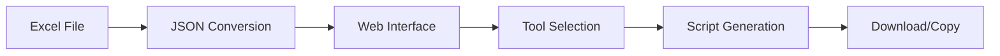

# DevSetup 🛠️

[](https://opensource.org/licenses/MIT)
[](https://nextjs.org/)
[](https://reactjs.org/)
[](https://www.typescriptlang.org/)

> **A modern web-based tool for generating cross-platform developer environment setup scripts**

## 📋 Table of Contents

- [Project Overview](#-project-overview)
- [Why DevSetup?](#-why-devsetup)
- [Quick Start](#-quick-start)
- [Usage Guide](#-usage-guide)
- [Features](#-features)
- [Supported Platforms](#-supported-platforms)
- [Project Structure](#-project-structure)
- [Contributing](#-contributing)
- [FAQ](#-faq)
- [License](#-license)

## 🎯 Project Overview

DevSetup is a web-based tool that generates installation scripts for various developer tools and software based on your operating system and preferred package manager. It streamlines the process of setting up development environments by creating customized installation scripts that can be run on Windows, macOS, or Linux systems.

### What DevSetup Does

1. **Simplifies Tool Selection**: Browse categorized developer tools in an intuitive interface
2. **Generates Custom Scripts**: Creates platform-specific installation scripts automatically
3. **Supports Multiple Package Managers**: Works with Chocolatey, Winget, Scoop, Homebrew, APT, DNF, and Pacman
4. **Ensures Consistency**: Helps teams maintain identical development environments across machines

## 🤔 Why DevSetup?

Setting up a development environment traditionally involves:
- Manually installing dozens of tools one by one
- Remembering different installation commands for each OS
- Ensuring all team members have the same tools installed
- Spending hours on repetitive setup tasks

**DevSetup solves these problems by:**
- **Automating the process**: Select tools once, generate scripts for any platform
- **Ensuring consistency**: Same tools, same versions, across all team members
- **Saving time**: What takes hours manually now takes minutes
- **Reducing errors**: No more forgotten dependencies or missed installations

## 🚀 Quick Start

### Prerequisites

- **Node.js** 18.0 or higher
- **npm** or **yarn** package manager
- A modern web browser (Chrome, Firefox, Safari, Edge)

### Installation

1. **Clone the Repository**
   - Clone this repository to your local machine.

   ```bash
   git clone https://github.com/yourusername/DevSetup.git
   cd DevSetup
   ```

2. **Install Dependencies**
   ```bash
   npm install
   ```

3. **Start the Development Server**
   ```bash
   npm run dev
   ```

4. **Open Your Browser**
   Navigate to [http://localhost:3000](http://localhost:3000)

### Production Build

```bash
npm run build
npm start
```

## 📖 Usage Guide

### Step-by-Step Instructions

1. **Select Your Operating System**
   - Choose between Windows, macOS, or Linux
   - The interface will automatically show compatible package managers

2. **Choose Your Package Manager**
   - **Windows**: Chocolatey, Winget, or Scoop
   - **macOS**: Homebrew
   - **Linux**: APT, DNF, or Pacman

3. **Browse and Select Tools**
   - Tools are organized by categories (IDEs, Version Control, Development Tools, etc.)
   - Check the boxes for tools you want to install
   - Only tools compatible with your selected OS and package manager will be available

4. **Generate Your Script**
   - Click the "Generate Script" button
   - The script will appear in the output area with proper formatting

5. **Use Your Script**
   - **Copy to Clipboard**: Click the copy button for immediate use
   - **Download**: Save as `.bat` (Windows) or `.sh` (macOS/Linux) file
   - **Run**: Execute the script in your terminal/command prompt

### How It Works Behind the Scenes



1. **Data Source**: Tool information is stored in `tools.xlsx`
2. **Conversion**: `convertExcelToJson.js` converts Excel data to JSON
3. **Loading**: Web app loads tool data from `tools.json`
4. **Selection**: User selects OS, package manager, and tools
5. **Generation**: Custom installation script is created
6. **Output**: Script can be copied or downloaded

## ✨ Features

- **🎯 Cross-Platform Support**: Windows, macOS, and Linux
- **📦 Multiple Package Managers**: 7 different package managers supported
- **🗂️ Categorized Tools**: Organized by IDEs, Version Control, Development Tools, Utilities
- **📜 Smart Script Generation**: Platform-specific scripts with proper formatting
- **📋 One-Click Actions**: Copy to clipboard or download instantly
- **🌙 Modern UI**: Clean, responsive interface with dark/light theme
- **🔧 Easy Maintenance**: Add new tools via Excel file
- **⚡ Fast & Offline**: No external dependencies, works offline after initial load

## 🖥️ Supported Platforms

| Platform | Package Managers | Script Format | Example Tools |
|----------|------------------|---------------|---------------|
| **Windows** | Chocolatey, Winget, Scoop | `.bat` | Git, VS Code, Node.js |
| **macOS** | Homebrew | `.sh` | Git, VS Code, Docker |
| **Linux** | APT, DNF, Pacman | `.sh` | Git, Vim, Python |

### Tool Categories Available

- **IDEs & Editors**: Visual Studio Code, IntelliJ IDEA, Sublime Text, Vim
- **Version Control**: Git, GitHub CLI, GitKraken, Sourcetree
- **Development Tools**: Node.js, Python, Docker, Postman, Insomnia
- **Browsers**: Chrome, Firefox, Edge, Brave
- **Utilities**: 7-Zip, Slack, Discord, Figma
- **And many more...**

## 📁 Project Structure

```
DevSetup/
├── src/
│   ├── app/
│   │   ├── page.tsx          # Main application component
│   │   ├── layout.tsx        # App layout and metadata
│   │   └── globals.css       # Global styles
│   └── components/           # Reusable React components
├── public/
│   ├── tools.xlsx           # Excel database of tools
│   ├── tools.json           # Generated JSON data
│   └── images/              # Tool icons and assets
├── convertExcelToJson.js    # Excel to JSON conversion script
├── CONTRIBUTING.md          # Contribution guidelines
├── PROJECT_STRUCTURE.md     # Detailed project structure
├── README.md               # This file
└── package.json            # Dependencies and scripts
```

### Key Files & Scripts

- **`tools.xlsx`**: Master database containing all tool information
- **`convertExcelToJson.js`**: Converts Excel data to JSON format
- **`tools.json`**: Generated JSON file consumed by the web application
- **`page.tsx`**: Main React component with application logic

### Available Scripts

```bash
npm run dev        # Start development server
npm run build      # Build for production
npm start          # Start production server
npm run lint       # Run ESLint
```

## 🤝 Contributing

We welcome contributions! Here are ways you can help:

- **Add new tools** to the database
- **Improve the user interface**
- **Fix bugs** and issues
- **Enhance documentation**
- **Suggest new features**

### Quick Start for Contributors

1. Fork the repository
2. Create a feature branch: `git checkout -b feature/new-tool`
3. Make your changes
4. Test thoroughly
5. Submit a pull request

**For detailed instructions**, see our [Contributing Guide](CONTRIBUTING.md).

### Adding New Tools

1. Open `public/tools.xlsx`
2. Add tool information in a new row
3. Run: `node convertExcelToJson.js`
4. Test the changes locally
5. Submit a pull request

## ❓ FAQ

### General Questions

**Q: Can I use DevSetup offline?**
A: Yes! Once loaded, the application works completely offline.

**Q: How do I add a tool that's not listed?**
A: See our [Contributing Guide](CONTRIBUTING.md) for step-by-step instructions.

**Q: Can I modify the generated scripts?**
A: Absolutely! Copy the script and customize it for your specific needs.

**Q: Does DevSetup work on all operating systems?**
A: The web application works on any OS with a modern browser. The generated scripts are platform-specific.

**Q: Can I host DevSetup on my own server?**
A: Yes! It's a static Next.js application that can be deployed anywhere.


## 📄 License

This project is licensed under the MIT License - see the [LICENSE](LICENSE) file for details.

### Attribution

- Built with [Next.js](https://nextjs.org/) and [React](https://reactjs.org/)
- Icons provided by [React Icons](https://react-icons.github.io/react-icons/)
- Styled with [TailwindCSS](https://tailwindcss.com/)

---

**Made with ❤️ for the developer community**

[Report Bug](https://github.com/CodeCompasss/DevSetup/issues) · [Request Feature](https://github.com/CodeCompasss/DevSetup/issues) · [Contribute](CONTRIBUTING.md)

---

## 🚀 What's Next?

DevSetup continues to evolve! Here's what we're working on:

- **More tools**: Expanding our database with community contributions
- **Better UI**: Enhanced user experience and accessibility
- **Advanced features**: Tool version selection, custom commands
- **Integration**: API for CI/CD pipelines and automation tools

Join our community and help shape the future of developer environment setup!
